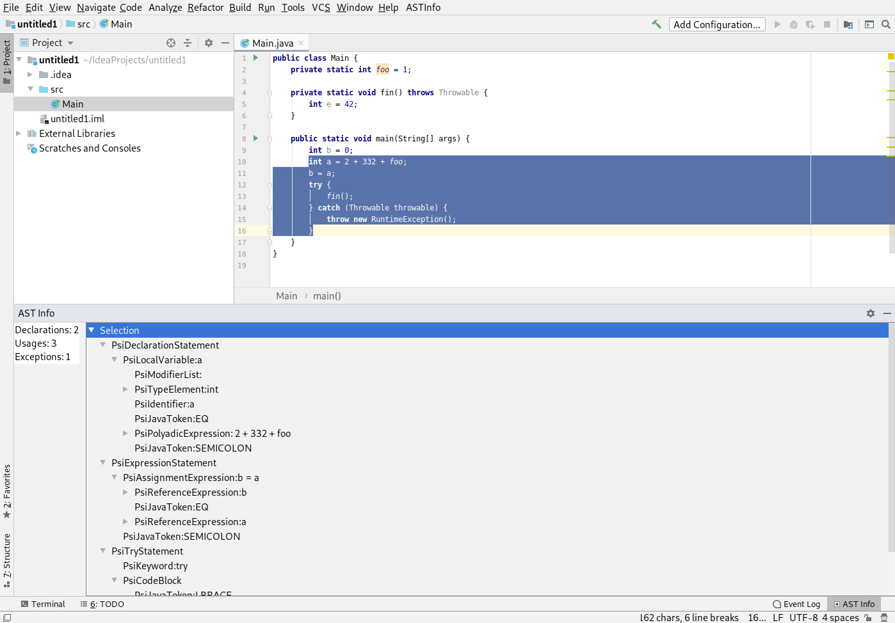

# AST Info plugin

Author - Dmitrii Abramov.

This plugin shows AST of selected code fragment and following statistics:

- Number of variable declarations inside selection
- Number of **read** variable accesses in selection
- Number of exceptions which may be thrown during execution of selected fragment

## Usage

Simplest way to run the plugin is:  
`./gradlew runIde`

To display AST and info for selection:

1. Select some code in editor.
2. Press `AST Info` button under `AST Info` button.
3. Tool Window with AST and statistics will appear.
4. To see info for another code fragment: GOTO 1.

## Implementation Details

Plugin uses `ToolWindow` from Intellij API to present it's UI.

Internal Intellij AST representation - PSI (Program Structure Interface) is used to present tree structure in plugin.

#### AST by selection

Algorithm:

- Retrieve nodes of AST which correspond to begin and end of the selection.
- Find lowest common `ancestor` for `begin` and  `end` node.
- If all `ancestor` children intersect with selection, return the subtree with root in `ancestor`.
- Otherwise the list of subtrees with roots in each `ancestor` child which intersects with the selection is returned. 

#### Statistics by selection

_Considering **variable** as local variable or field._

##### Declarations

Visiting all nodes in AST corresponding to selection and counting all variable and field declaration nodes.

##### Usages

Visiting all nodes in AST corresponding to selection 
and counting all Reference Expression nodes which are **read** access 
(i.e. this reference is **not** on the left of assignment operator).

##### Exceptions

Here I reused functionality of Intellij API (method `com.intellij.codeInsight.ExceptionUtil::getThrownExceptions`). 

It traverses AST and processes all function calls and gets all exceptions from their function declaration `throws` list. 

Also it processes all `throw` expressions and `try` statements (for `try` statement it correctly doesn't count exceptions which are catch by `catch` close).
